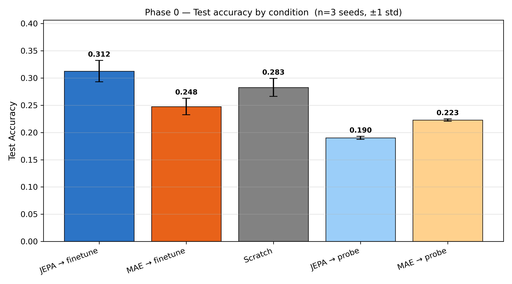
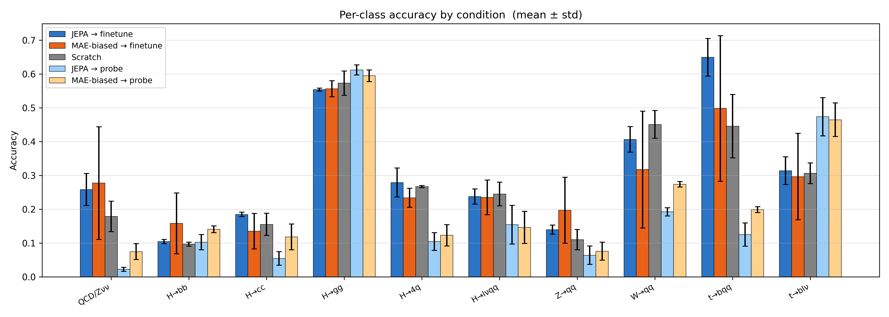
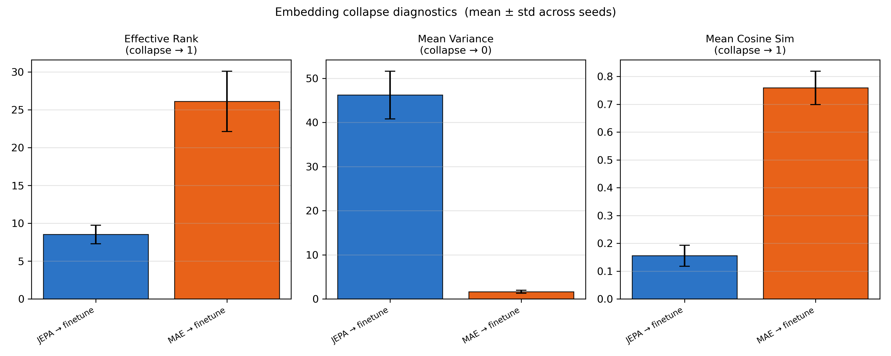

# Phase 0 — Multi-Seed Rigorous Baseline

Establishes credible baseline numbers for JEPA vs MAE vs scratch training before any novel architectural work. All results are aggregated over **3 random seeds (42, 123, 456)** on a balanced **100k-jet subset** of JetClass (10 classes, 8k/1k/1k train/val/test per class).

---

## Conditions

| Condition | Description |
|-----------|-------------|
| `jepa_finetune` | Pretrain with JEPA (20 epochs), then fine-tune encoder + head |
| `mae_finetune` | Pretrain with MAE (20 epochs), then fine-tune encoder + head |
| `scratch` | Train encoder + head from random init, no pretraining |
| `jepa_probe` | Pretrain with JEPA, freeze encoder, train linear head only |
| `mae_probe` | Pretrain with MAE, freeze encoder, train linear head only |

---

## Results (mean ± std, 3 seeds)

| Condition | Test Accuracy |
|-----------|:-------------:|
| **JEPA → finetune** | **31.25% ± 1.96%** |
| Scratch | 28.26% ± 1.65% |
| MAE → finetune | 24.76% ± 1.50% |
| MAE → probe | 22.28% ± 0.20% |
| JEPA → probe | 19.02% ± 0.27% |

<p align="center">
  
</p>

Two notable findings:

- **JEPA finetune beats MAE finetune by +6.5 pp**, and beats scratch by +3 pp. JEPA learns relational structure in latent space rather than per-particle feature statistics, which transfers better to classification.
- **Scratch outperforms MAE finetune** — negative transfer. The MAE reconstruction objective (predict raw pT/η/φ/E) encourages the encoder to memorise low-level feature statistics, which is the wrong inductive bias for jet topology classification. Pretraining on the wrong objective actively hurts.
- **MAE probe > JEPA probe** — MAE representations are more linearly separable because they encode raw feature correlations that a linear head can exploit. JEPA representations are more abstract and require the non-linearity of fine-tuning to surface.

---

## Per-Class Accuracy

<p align="center">
  
</p>

| Class | JEPA → finetune | MAE → finetune | Scratch |
|-------|:---------------:|:--------------:|:-------:|
| QCD/Z→νν | 0.258 ± 0.047 | 0.168 ± 0.034 | 0.179 ± 0.045 |
| H→bb̄ | 0.104 ± 0.006 | 0.166 ± 0.039 | 0.096 ± 0.006 |
| H→cc̄ | 0.184 ± 0.007 | 0.160 ± 0.045 | 0.155 ± 0.033 |
| H→gg | 0.554 ± 0.004 | 0.500 ± 0.034 | 0.573 ± 0.036 |
| H→4q | 0.279 ± 0.043 | 0.217 ± 0.104 | 0.267 ± 0.003 |
| H→ℓνqq′ | 0.237 ± 0.022 | 0.199 ± 0.093 | 0.245 ± 0.035 |
| Z→qq̄ | 0.139 ± 0.014 | 0.066 ± 0.056 | 0.110 ± 0.030 |
| W→qq′ | 0.406 ± 0.038 | 0.366 ± 0.069 | 0.451 ± 0.041 |
| **t→bqq′** | **0.649 ± 0.055** | 0.340 ± 0.129 | 0.446 ± 0.094 |
| t→bℓν | 0.314 ± 0.041 | 0.293 ± 0.130 | 0.306 ± 0.031 |

JEPA's largest margin is on **t→bqq′ (+31 pp over MAE, +20 pp over scratch)** — a three-body hadronic top decay that requires reasoning about the relationship between the b-jet and the two light quarks from W→qq′. This is precisely the kind of inter-particle relational structure JEPA is designed to capture.

---

## Embedding Collapse Diagnostics

<p align="center">
  
</p>

| Metric | JEPA | MAE |
|--------|:----:|:---:|
| Effective rank | ~7 | ~25 |
| Mean variance | ~48 | ~1.8 |
| Mean cosine sim | ~0.21 | ~0.67 |

MAE embeddings have high effective rank and high cosine similarity — many directions are used but they all point similarly, suggesting the encoder spreads load across dimensions without producing diverse representations. JEPA has lower effective rank but much higher variance and lower cosine similarity — fewer but more distinct, well-separated embedding directions.

---

## Files

| File | Purpose |
|------|---------|
| `run_phase0.py` | Orchestrates all 5 conditions across multiple seeds; writes `results/seed_{seed}.json` |
| `analyze_results.py` | Aggregates seed JSONs → summary tables + figures |
| `linear_probe.py` | Standalone linear probe (frozen encoder + linear head) |
| `patch_results.py` | One-off backfill script for fixing missing fields in existing JSONs |
| `configs/linear_probe.yaml` | Hyperparameters for linear probe (AdamW, CosineAnnealingLR, 10 epochs) |
| `results/` | Seed JSONs and output figures |

---

## Reproducing

```bash
# Run all 5 conditions for 3 seeds (~1-2 hrs per seed on A100)
python experiments/phase0/run_phase0.py \
    --data-dir ./data --seeds 42 123 456 --gpu 0

# Aggregate and plot
python experiments/phase0/analyze_results.py \
    --results-dir ./experiments/phase0/results
```

Use `--skip-pretrain`, `--skip-finetune`, `--skip-probe` to resume after preemption.
